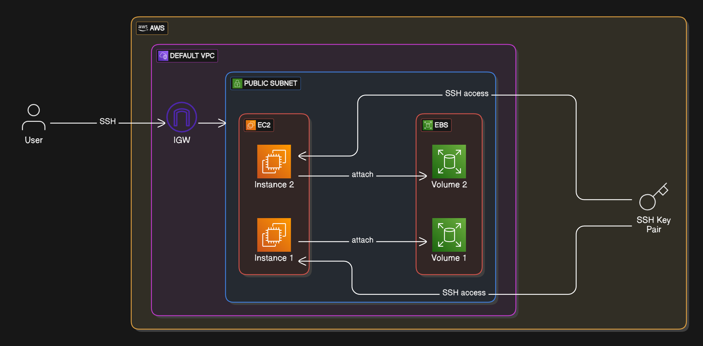

# Mastering-Ansible-AWS-Labs

This is the complete guide and my learnings of `Ansible` with practical labs on AWS using Terraform for the infrastructure provisioning.

## The Architecture of AWS Infrastructure that we'll be creating and using Terraform for learning Ansible.

## 

## What is Ansible?

> Ansible is an IT automation tool like systems, cloud, networking and automating all the things.

> It's an `open-source` automation tool used for `configuration management`, `application deployment`, `orchestration`, and `task automation`.

> It's agentless (uses SSH for linux/Unix & WinRM for windows) and utilizes `YAML` to define `playbooks` making it human readable & easy to write.
